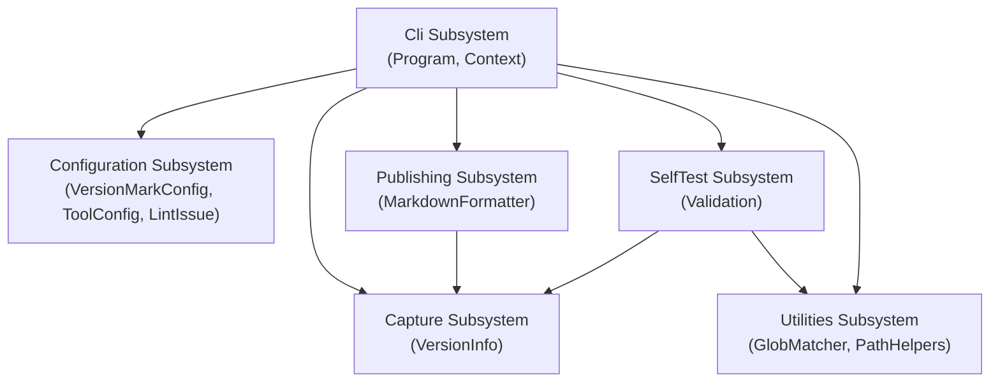

# VersionMark

## Architecture

VersionMark is structured as a single system comprising six subsystems. There is no
system-level code — the system is a collection of subsystems and units.



| Subsystem     | Units                                    | Responsibility                                      |
|---------------|------------------------------------------|-----------------------------------------------------|
| Cli           | Program, Context                         | Argument parsing, mode dispatch, output routing     |
| Configuration | VersionMarkConfig, ToolConfig, LintIssue | YAML config loading, validation, version capture    |
| Capture       | VersionInfo                              | JSON serialization of captured version data         |
| Publishing    | MarkdownFormatter                        | Markdown report generation from captured data       |
| SelfTest      | Validation                               | Built-in self-verification of all operational modes |
| Utilities     | GlobMatcher, PathHelpers                 | Glob-pattern matching and safe path combination     |

The tool operates in four distinct modes, selected by command-line flags:

| Mode     | Flag         | Description                                              |
|----------|--------------|----------------------------------------------------------|
| Capture  | `--capture`  | Runs configured commands and saves versions to JSON      |
| Publish  | `--publish`  | Reads JSON files and generates a markdown version report |
| Lint     | `--lint`     | Validates the `.versionmark.yaml` configuration file     |
| Validate | `--validate` | Runs built-in self-verification tests                    |

### Inter-Subsystem Interactions

The subsystems interact as follows during the four operational modes.

#### Capture Mode

1. The Cli Subsystem (Program) parses arguments and calls `RunCapture`.
2. `RunCapture` uses the Configuration Subsystem to load `.versionmark.yaml` and call
   `FindVersions`, which executes shell commands and extracts version strings.
3. The result is saved to disk by `VersionInfo.SaveToFile` (Capture Subsystem).

#### Publish Mode

1. The Cli Subsystem (Program) parses arguments and calls `RunPublish`.
2. `RunPublish` uses `GlobMatcher.FindMatchingFiles` (Utilities Subsystem) to resolve glob
   patterns into a concrete list of JSON file paths.
3. The Capture Subsystem loads each JSON file via `VersionInfo.LoadFromFile`.
4. The Publishing Subsystem (`MarkdownFormatter.Format`) converts the loaded records into
   a markdown string, which is written to the report file.

#### Lint Mode

1. The Cli Subsystem (Program) calls `RunLint`, which resolves the config file path,
   defaulting to `.versionmark.yaml`.
2. `RunLint` delegates to `VersionMarkConfig.Load`, which validates the YAML structure and
   returns a `VersionMarkLoadResult` containing all `LintIssue` records found.
3. `RunLint` calls `result.ReportIssues` to write all issues to the context. When no issues
   are found, no console output is produced — consistent with the integration tests asserting
   `string.IsNullOrEmpty(output)` for a clean lint run.

#### Validate Mode

1. The Cli Subsystem (Program) calls `Validation.Run`.
2. The SelfTest Subsystem exercises capture, publish, and lint modes end-to-end,
   using `PathHelpers` to safely construct paths inside a temporary directory.

The self-validation suite includes the following named tests:

| Test Name                                    | What it Verifies                                                   |
|----------------------------------------------|--------------------------------------------------------------------|
| `VersionMark_CapturesVersions`               | Capture mode correctly runs commands and saves version JSON        |
| `VersionMark_GeneratesMarkdownReport`        | Publish mode correctly reads JSON and produces a markdown report   |
| `VersionMark_LintPassesForValidConfig`       | Lint mode passes for a valid `.versionmark.yaml` configuration     |
| `VersionMark_LintReportsErrorsForInvalidConfig` | Lint mode reports errors for an invalid configuration           |

## External Interfaces

**Command-line arguments**: The primary input interface for all operational modes.

- *Type*: CLI (POSIX-style flags).
- *Role*: Consumer — VersionMark reads arguments from the OS process argument array.
- *Contract*: Parsed by `Context.Create`; mode flags (`--capture`, `--publish`, `--lint`,
  `--validate`) select the operational mode; `--` separates mode-specific positional
  arguments (tool names for capture, glob patterns for publish).
- *Constraints*: Unknown flags cause `ArgumentException`. The full flag set is defined in
  the Cli Subsystem design.

**`.versionmark.yaml`**: The tool configuration file.

- *Type*: File (YAML, UTF-8).
- *Role*: Consumer — VersionMark reads this file in capture and lint modes.
- *Contract*: Must contain a `tools` mapping with at least one entry. Each tool entry must
  have a `command` and a `regex` with a named `version` capture group. OS-specific overrides
  (`command-win`, `regex-linux`, etc.) are optional.
- *Constraints*: File must exist when capture or lint mode is invoked. Validation issues are
  reported with file name and line/column location.

**`versionmark-<id>.json`**: Capture output / publish input file.

- *Type*: File (JSON indented UTF-8).
- *Role*: Provider (written by capture mode) and Consumer (read by publish mode).
- *Contract*: Contains `JobId` (string) and `Versions` (object mapping tool names to version
  strings). Property names match C# property names directly. Default filename is
  `versionmark-<job-id>.json`; overridden with `--output`.
- *Constraints*: Written by capture mode; read by publish mode. Overwritten if already exists.

**`<report>.md`**: Markdown version report.

- *Type*: File (Markdown UTF-8).
- *Role*: Provider — written by publish mode.
- *Contract*: Contains a `Tool Versions` section with markdown bullet items. Heading level
  controlled by `--report-depth` (default: value of `--depth`, which defaults to `1`).
  Conflicting versions across jobs are listed with contributing job IDs in parentheses.
- *Constraints*: Requires `--report` flag. Overwritten if the file already exists.

**`<log>.log`**: Optional log file.

- *Type*: File (plain text UTF-8, auto-flush).
- *Role*: Provider — optionally written when `--log <file>` is specified.
- *Contract*: Contains the same output as stdout, including error messages.
- *Constraints*: Created or overwritten when `--log` is specified; absent otherwise.

**`<results>.trx` / `<results>.xml`**: Optional validation results file.

- *Type*: File (TRX XML or JUnit XML UTF-8).
- *Role*: Provider — optionally written when `--results <file>` is specified in validate mode.
- *Contract*: `.trx` extension → TRX format (MSTest compatible); `.xml` extension → JUnit
  XML format. Other extensions produce an error via `context.WriteError`.
- *Constraints*: Only written when `--validate` is also specified.

**Shell environment**: OS command execution for version capture.

- *Type*: OS shell.
- *Role*: Consumer — VersionMark invokes the OS shell to execute tool commands.
- *Contract*: `cmd.exe /c` on Windows; `/bin/sh -c` on Linux and macOS. Commands and
  regex patterns are defined in `.versionmark.yaml`. stdout and stderr are captured
  asynchronously to prevent pipe deadlock.
- *Constraints*: Non-zero exit code from a shell command raises `InvalidOperationException`.

**Console (`stdout`)**: Standard output for progress and tool version messages.

- *Type*: Console (plain text).
- *Role*: Provider — VersionMark writes to stdout.
- *Contract*: Progress messages, captured versions, and report confirmation are written here.
- *Constraints*: All stdout output is suppressed when `--silent` is specified.

**Console (`stderr`)**: Standard error for error messages.

- *Type*: Console (plain text, red).
- *Role*: Provider — VersionMark writes to stderr.
- *Contract*: Error messages always written in red. When source location is known (e.g. a
  lint issue), the message is prefixed as `filename(line,column): error: description`.
- *Constraints*: Suppressed when '--silent' is set; callers detect failures via the process exit code.

## Dependencies

- **YamlDotNet** — YAML deserialization of `.versionmark.yaml`; see _YamlDotNet
  Integration Design_ for details.
- **Microsoft.Extensions.FileSystemGlobbing** — glob-pattern file matching in publish mode;
  see _Microsoft.Extensions.FileSystemGlobbing Integration Design_ for details.
- **DemaConsulting.TestResults** — TRX and JUnit XML serialization of self-validation
  results; see _DemaConsulting.TestResults Integration Design_ for details.

## Risk Control Measures

N/A — VersionMark is a build-tool and reporting aid with no patient-safety,
financial-transaction, or safety-critical responsibilities. No software item segregation
for risk control purposes is required.

## Data Flow

**Capture mode** (user invokes `versionmark --capture --job-id <id>`):

```text
Command-line args
      ↓
  Context (Cli)            parses flags and arguments
      ↓
  VersionMarkConfig.Load   reads and validates .versionmark.yaml
      ↓
  VersionMarkConfig.FindVersions   executes shell commands via OS shell
      ↓
  VersionInfo.SaveToFile   writes versionmark-<id>.json to disk
```

**Publish mode** (user invokes `versionmark --publish --report <file> -- <patterns>`):

```text
Command-line args
      ↓
  Context (Cli)                   parses flags and glob patterns
      ↓
  GlobMatcher.FindMatchingFiles   resolves patterns to JSON file paths
      ↓
  VersionInfo.LoadFromFile (×N)   deserializes each JSON file
      ↓
  MarkdownFormatter.Format        consolidates versions into markdown string
      ↓
  <report>.md written to disk
```

**Lint mode** (user invokes `versionmark --lint [<file>]`):

```text
Command-line args
      ↓
  Context (Cli)            parses flags and optional config path
      ↓
  VersionMarkConfig.Load   validates .versionmark.yaml; collects LintIssue records
      ↓
  LintIssue.ReportIssues   writes issues to stdout/stderr
```

**Validate mode** (user invokes `versionmark --validate`):

```text
Command-line args
      ↓
  Context (Cli)
      ↓
  Validation.Run   exercises capture, publish, and lint modes in temp directories
      ↓
  results summary + optional TRX/JUnit file
```

## Design Constraints

| Constraint               | Value / Description                                                              |
|--------------------------|----------------------------------------------------------------------------------|
| Target frameworks        | .NET 8, .NET 9, .NET 10 (multi-targeted)                                         |
| Supported platforms      | Windows, Linux, macOS                                                            |
| Shell execution          | `cmd.exe /c` on Windows; `/bin/sh -c` on Linux and macOS                         |
| Nullable reference types | Enabled; all public APIs annotated                                               |
| Warnings as errors       | Enabled; build fails on any warning                                              |
| Distribution             | NuGet global tool (`dotnet tool install -g DemaConsulting.VersionMark`)          |
| No network access        | No network calls at runtime; all I/O is local file system and shell              |
| Regex timeout            | User-supplied regex patterns have a 1-second evaluation timeout                  |
